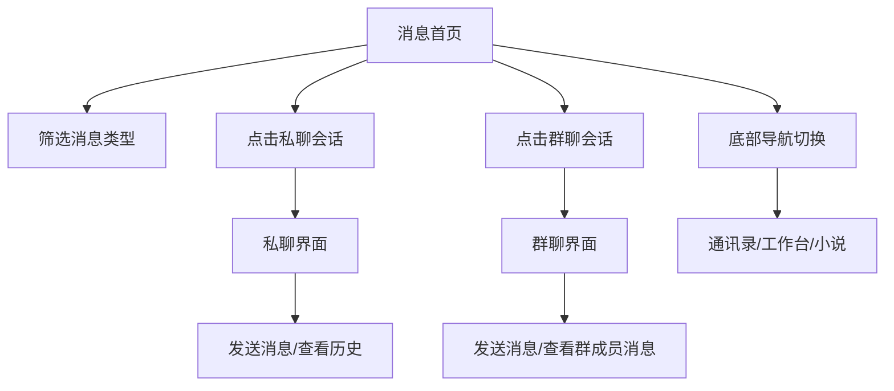

## 1. 产品概述
基于uni-app框架开发的移动端消息应用首页，提供类似微信的消息列表展示功能。用户可以通过该页面查看不同类型的消息会话，包括单聊、群聊、@消息等，并支持消息筛选和快速导航。

目标用户为需要移动端即时通讯功能的个人和企业用户，产品价值在于提供简洁高效的消息管理界面。

## 2. 核心功能

### 2.1 用户角色
| 角色 | 注册方式 | 核心权限 |
|------|----------|----------|
| 普通用户 | 手机号/邮箱注册 | 查看消息列表、发送消息、管理会话 |

### 2.2 功能模块
消息应用包含以下主要功能模块：
1. **消息首页**：顶部导航栏、消息筛选标签、消息列表展示、底部导航栏
2. **私聊界面**：聊天头部栏、消息气泡展示、日期分隔、附件卡片、底部输入栏
3. **群聊界面**：群聊头部栏、成员消息展示、图片卡片、文件卡片、底部输入栏

### 2.3 页面详情
| 页面名称 | 模块名称 | 功能描述 |
|----------|----------|----------|
| 消息首页 | 顶部导航栏 | 显示用户头像、页面标题"消息"、搜索图标、通话图标、添加图标、设置图标 |
| 消息首页 | 筛选标签栏 | 展示全部、未读、@我、单聊、群聊等筛选选项，支持点击切换 |
| 消息首页 | 消息列表 | 显示会话列表，包含头像、名称、最新消息摘要、时间戳、未读消息徽章 |
| 消息首页 | 底部导航 | 提供消息、通讯录、工作台、小说四个主要功能入口 |
| 私聊界面 | 聊天头部栏 | 显示返回按钮、联系人名称、电话图标、视频图标、更多菜单图标 |
| 私聊界面 | 消息展示区域 | 显示日期分隔线、左右消息气泡（左为对方消息，右为我的消息）、附件卡片 |
| 私聊界面 | 底部输入栏 | 语音输入按钮、文本输入框、表情图标、添加附件按钮 |
| 群聊界面 | 群聊头部栏 | 显示返回按钮、群名称和成员数量、群通话图标、更多菜单图标 |
| 群聊界面 | 消息展示区域 | 显示日期分隔线、成员名称标签、群消息气泡、图片卡片、文件卡片 |
| 群聊界面 | 底部输入栏 | 与私聊界面相同，支持语音、文本、表情、附件功能 |

## 3. 核心流程
用户操作流程：
1. 用户进入消息首页，默认显示全部消息列表
2. 可点击筛选标签切换不同类型的消息视图
3. 点击具体消息项进入对应的聊天界面（私聊或群聊）
4. 在聊天界面可发送文本消息、查看历史消息、发送附件
5. 通过底部导航栏切换不同功能模块

私聊流程：
1. 从消息首页点击私聊会话进入私聊界面
2. 查看与联系人的历史消息记录
3. 在底部输入框输入消息并发送
4. 可发送附件、表情等内容

群聊流程：
1. 从消息首页点击群聊会话进入群聊界面
2. 查看群内所有成员的消息，显示发送者名称
3. 在底部输入框输入消息并发送
4. 可发送图片、文件、@全体成员等内容

## 4. 用户界面设计

### 4.1 设计风格
- **主色调**：白色背景，蓝色作为激活状态颜色
- **按钮样式**：扁平化设计，圆角按钮
- **字体**：系统默认字体，标题18px，正文14px，辅助文字12px
- **布局风格**：列表式布局，卡片化展示
- **图标风格**：线性图标，简洁现代

### 4.2 页面设计概述
| 页面名称 | 模块名称 | UI元素 |
|----------|----------|----------|
| 消息首页 | 顶部导航栏 | 左侧圆形头像(40px)，中间标题"消息"(18px，加粗)，右侧四个功能图标(24px) |
| 消息首页 | 筛选标签栏 | 横向滚动标签，圆角胶囊样式，激活状态蓝色文字，默认灰色文字 |
| 消息首页 | 消息列表 | 头像(48px圆形)，名称(14px深灰色)，消息摘要(12px浅灰色)，时间戳(12px浅灰色)，红色未读徽章(16px) |
| 消息首页 | 底部导航 | 图标(24px)配合文字标签(12px)，激活状态蓝色，默认灰色 |
| 私聊界面 | 聊天头部栏 | 左侧返回箭头图标，中间联系人名称(16px，加粗)，右侧电话、视频、更多图标(24px) |
| 私聊界面 | 消息气泡 | 左侧对方消息：白色背景，圆角8px，阴影效果；右侧我的消息：白色背景，圆角8px，阴影效果 |
| 私聊界面 | 日期分隔 | 灰色文字，居中显示，格式"11月21日 下午3:39" |
| 私聊界面 | 附件卡片 | 白色卡片背景，蓝色标题文字带下划线，灰色小字副标题 |
| 私聊界面 | 底部输入栏 | 左侧语音和添加按钮，中间输入框，右侧表情和发送按钮 |
| 群聊界面 | 群聊头部栏 | 左侧返回箭头图标，中间群名称和成员数(16px，加粗)，右侧群通话、更多图标(24px) |
| 群聊界面 | 群消息展示 | 成员名称显示在消息气泡旁边(12px，灰色)，支持图片卡片和文件卡片 |
| 群聊界面 | 图片卡片 | 包含海报图片和文字说明，支持@全体成员功能 |
| 群聊界面 | 文件卡片 | 白色卡片，蓝色标题，绿色文件图标，显示文件名称 |

### 4.3 响应式设计
采用移动优先设计策略，适配不同尺寸的手机屏幕，确保在各种设备上都有良好的用户体验。

### 4.4 聊天界面背景设计
**私聊界面背景**：
- 使用浅蓝色渐变背景，营造轻松私密的聊天氛围
- 渐变从顶部浅蓝(#E3F2FD)到底部更浅的蓝色(#F5F5F5)
- 确保文字可读性，消息气泡使用白色背景

**群聊界面背景**：
- 使用星空/太空主题背景图片
- 深蓝色基调，点缀星星元素
- 消息气泡同样使用白色背景确保内容清晰可读

### 4.5 交互说明
**消息首页交互**：
- 消息列表项支持左滑删除操作
- 未读消息徽章显示未读数量
- 筛选标签支持横向滑动查看更多选项
- 底部导航栏固定在页面底部

**聊天界面交互**：
- 点击返回按钮可返回消息首页
- 点击头部电话/视频图标可发起通话
- 消息气泡支持长按复制、转发、删除等操作
- 底部输入框支持语音转文字输入
- 添加按钮支持发送图片、文件、位置等附件
- 群聊界面支持@群成员功能
- 图片和文件卡片支持点击查看详情