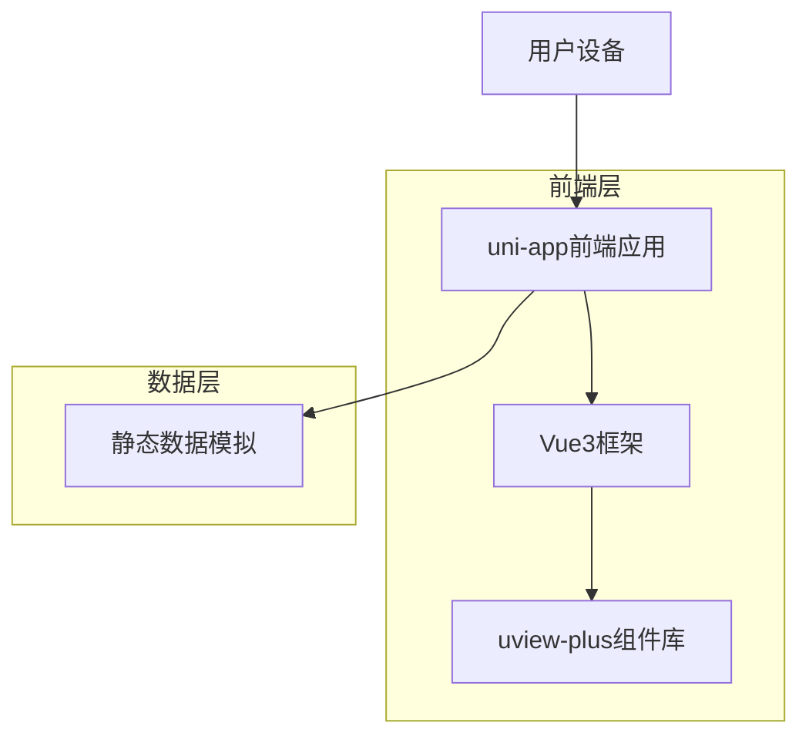
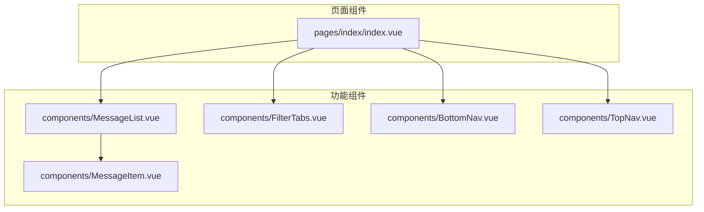
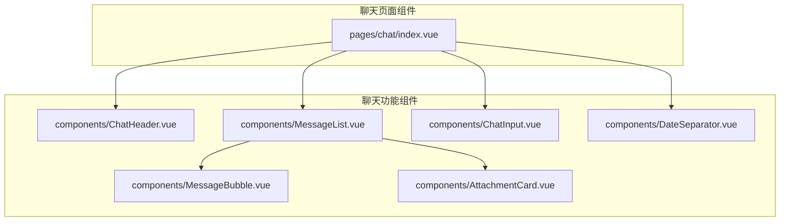
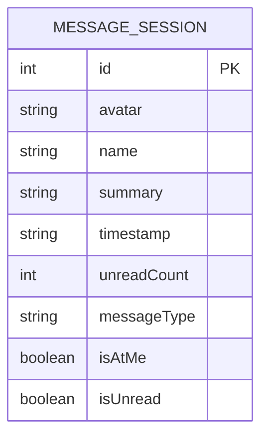
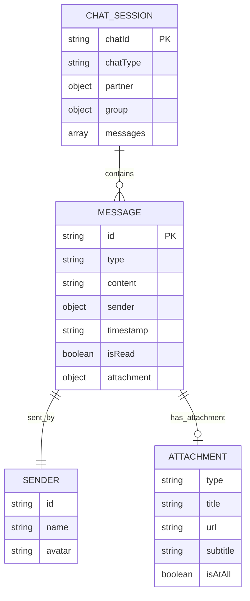

## 1. 架构设计



## 2. 技术描述

- **前端框架**：uni-app + Vue3 + JavaScript
- **初始化工具**：npx degit dcloudio/uni-preset-vue#vite
- **UI组件库**：uview-plus
- **样式方案**：SCSS/CSS3
- **构建工具**：Vite
- **后端服务**：无（静态数据展示）

## 3. 路由定义

| 路由 | 用途 |
|-------|---------|
| / | 消息首页，显示消息列表和导航 |
| /pages/chat/index | 聊天界面，支持私聊和群聊功能 |
| /pages/contacts/index | 通讯录页面 |
| /pages/workbench/index | 工作台页面 |
| /pages/novel/index | 小说页面 |

## 4. 组件结构

### 4.1 核心组件

**消息列表组件 (MessageList)**
```javascript
// 组件属性
{
  messages: Array, // 消息列表数据
  filterType: String // 当前筛选类型
}
```

**消息项组件 (MessageItem)**
```javascript
// 组件属性
{
  avatar: String, // 头像URL
  name: String, // 联系人名称
  summary: String, // 消息摘要
  timestamp: String, // 时间戳
  unreadCount: Number, // 未读数量
  isUnread: Boolean // 是否未读
}
```

**筛选标签组件 (FilterTabs)**
```javascript
// 组件属性
{
  tabs: Array, // 标签配置
  activeTab: String // 当前激活标签
}
```

**聊天输入组件 (ChatInput)**
```javascript
// 组件属性
{
  placeholder: String, // 输入框占位符
  showVoice: Boolean, // 是否显示语音按钮
  showEmoji: Boolean, // 是否显示表情按钮
  showPlus: Boolean // 是否显示添加按钮
}

// 事件
@send="handleSend" // 发送消息事件
@voice="handleVoice" // 语音输入事件
@emoji="handleEmoji" // 表情选择事件
@plus="handlePlus" // 添加附件事件
```

**消息气泡组件 (MessageBubble)**
```javascript
// 组件属性
{
  message: Object, // 消息对象
  isOwn: Boolean, // 是否为自己的消息
  showAvatar: Boolean, // 是否显示头像
  showName: Boolean, // 是否显示名称（群聊用）
  messageType: String // 消息类型：text/image/file/card
}

// 消息对象结构
{
  id: String,
  content: String,
  sender: Object,
  timestamp: String,
  type: String, // text, image, file, card
  attachment: Object // 附件信息
}
```

**附件卡片组件 (AttachmentCard)**
```javascript
// 组件属性
{
  title: String, // 卡片标题
  subtitle: String, // 副标题
  type: String, // card类型：approval, file, image
  icon: String, // 图标类型
  url: String // 跳转链接
}
```

### 4.2 静态数据结构

**消息数据模型**
```javascript
{
  id: Number, // 消息ID
  avatar: String, // 头像路径
  name: String, // 联系人名称
  summary: String, // 最新消息内容
  timestamp: String, // 时间显示
  unreadCount: Number, // 未读数量
  messageType: String, // 消息类型：single/group
  isAtMe: Boolean, // 是否@我
  isUnread: Boolean // 是否未读
}
```

## 5. 页面架构

**消息首页架构**


**聊天界面架构**


## 6. 数据模型

### 6.1 数据模型定义

**消息会话模型**


**聊天消息模型**


### 6.2 本地静态数据

**消息列表数据 (mock/messages.js)**
```javascript
export const mockMessages = [
  {
    id: 1,
    avatar: '/static/avatar1.png',
    name: '刘勋（诸葛亮）',
    summary: '国际金希集团的项目合同，请刘总审批下...',
    timestamp: '23分钟前',
    unreadCount: 2,
    messageType: 'single',
    isAtMe: false,
    isUnread: true
  },
  {
    id: 2,
    avatar: '/static/avatar2.png',
    name: '研发通知群',
    summary: '戴欣欣：[图片]@所有人 各位同事...',
    timestamp: '59分钟前',
    unreadCount: 28,
    messageType: 'group',
    isAtMe: true,
    isUnread: true
  }
  // ... 更多消息数据
]
```

**筛选标签配置 (config/filterConfig.js)**
```javascript
export const filterTabs = [
  { key: 'all', label: '全部', count: 36 },
  { key: 'unread', label: '未读', count: 36 },
  { key: 'atme', label: '@我', count: 0 },
  { key: 'single', label: '单聊', count: 8 },
  { key: 'group', label: '群聊', count: 28 }
]
```

**聊天消息数据 (mock/chatMessages.js)**
```javascript
// 私聊消息数据
export const privateChatMessages = {
  chatId: 'chat_001',
  chatType: 'single',
  partner: {
    id: 'user_001',
    name: '刘勐',
    avatar: '/static/avatar_liumeng.png'
  },
  messages: [
    {
      id: 'msg_001',
      type: 'text',
      content: '国际金希集团的刘总还是很认可我们的方案，你尽快跟进下。',
      sender: 'partner',
      timestamp: '2024-11-21T15:39:00',
      isRead: true
    },
    {
      id: 'msg_002',
      type: 'text',
      content: '刚才和刘总联系了，他说本周在忙集团的检查事情，下周再约时间。',
      sender: 'self',
      timestamp: '2024-11-21T15:42:00',
      isRead: true
    },
    {
      id: 'msg_003',
      type: 'card',
      content: '《国际金希集团AI大模型合同》审批流程',
      sender: 'partner',
      timestamp: '2024-11-27T10:12:00',
      isRead: true,
      attachment: {
        type: 'approval',
        title: '《国际金希集团AI大模型合同》审批流程',
        subtitle: '协同办公电脑版',
        url: '/pages/approval/detail?id=123'
      }
    }
  ]
}

// 群聊消息数据
export const groupChatMessages = {
  chatId: 'group_001',
  chatType: 'group',
  group: {
    id: 'group_001',
    name: '研发通知群',
    memberCount: 297,
    avatar: '/static/avatar_group.png'
  },
  messages: [
    {
      id: 'gmsg_001',
      type: 'text',
      content: '通知：周五前请大家提交本月的工作总结和下月的工作计划',
      sender: {
        id: 'user_001',
        name: '刘勐',
        avatar: '/static/avatar_liumeng.png'
      },
      timestamp: '2024-11-25T09:30:00',
      isRead: true
    },
    {
      id: 'gmsg_002',
      type: 'image',
      content: '无篮球亦青春',
      sender: {
        id: 'user_001',
        name: '刘勐',
        avatar: '/static/avatar_liumeng.png'
      },
      timestamp: '2024-11-25T09:35:00',
      isRead: true,
      attachment: {
        type: 'image',
        title: '无篮球亦青春',
        url: '/static/basketball_poster.jpg',
        isAtAll: true
      }
    },
    {
      id: 'gmsg_003',
      type: 'file',
      content: '集团篮球俱乐部报名表',
      sender: {
        id: 'user_001',
        name: '刘勐',
        avatar: '/static/avatar_liumeng.png'
      },
      timestamp: '2024-11-25T09:36:00',
      isRead: true,
      attachment: {
        type: 'file',
        title: '集团篮球俱乐部报名表',
        fileName: 'basketball_registration.xlsx',
        fileSize: '24.5KB'
      }
    }
  ]
}
```

## 7. 开发规范

### 7.1 文件结构
```
src/
├── pages/
│   ├── index/
│   │   └── index.vue
│   └── chat/
│       └── index.vue
├── components/
│   ├── MessageList.vue
│   ├── MessageItem.vue
│   ├── FilterTabs.vue
│   ├── TopNav.vue
│   ├── BottomNav.vue
│   ├── ChatHeader.vue
│   ├── ChatInput.vue
│   ├── MessageBubble.vue
│   ├── AttachmentCard.vue
│   └── DateSeparator.vue
├── static/
│   ├── avatar*.png
│   ├── basketball_poster.jpg
│   └── background/
│       ├── chat_bg_blue.jpg
│       └── chat_bg_space.jpg
├── mock/
│   ├── messages.js
│   └── chatMessages.js
├── config/
│   ├── filterConfig.js
│   └── chatConfig.js
└── utils/
    ├── dateFormat.js
    └── messageFormat.js
```

### 7.2 样式规范
**基础规范**：
- 使用rpx作为单位，适配不同屏幕尺寸
- 颜色变量统一定义在common/css/variable.scss
- 组件样式采用scoped作用域
- 图标使用uview-plus内置图标库

**聊天界面样式**：
- 私聊背景：浅蓝色渐变，顶部#E3F2FD到底部#F5F5F5
- 群聊背景：星空主题背景图，确保消息可读性
- 消息气泡：白色背景，圆角8px，阴影效果
- 日期分隔：灰色文字，居中显示，字体12px
- 输入栏高度：100rpx，固定在底部
- 头像大小：聊天界面64rpx，消息列表48rpx

### 7.3 响应式设计
- 支持iPhone和Android主流设备尺寸
- 适配横竖屏切换
- 考虑刘海屏和底部安全区域